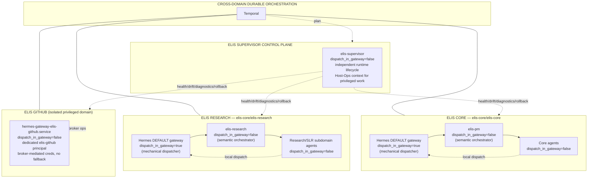

# Architecture Decision Record — ELIS Independent Hermes Execution Domains and Platform Control Plane

```yaml
adr_id: ADR-20260818-001
status: ACCEPTED (PO Carlos Rocha, 2026-08-18) — DESIGN/ADR ONLY, NO IMPLEMENTATION AUTHORISED
date: 2026-08-18
pe: ELIS-EXECUTION-DOMAIN-ARCHITECTURE
classification: DESIGN / ADR
owner: Carlos Rocha, Product Owner
author: ELIS PM (documentation only; no topology/config/runtime mutation)
governance: Supersedes the custom elis-dispatcher topology direction; reconciles repository naming (elis-core/slis → elis-research)
```

---

## 1. Decision Context

ELIS operates a set of Hermes agents with distinct responsibilities (Core
orchestration, research workflows incl. SLR, privileged GitHub execution) that
today share coordinated lifecycle. This ADR records the PO-approved **target
architecture**: three independent Hermes execution domains, an explicit
Supervisor control plane, cross-domain durable orchestration via Temporal, and a
Hermes-native mechanical-dispatch model. It is a **design record only** — it does
not authorise any implementation, topology change, gateway/service mutation, or
repository work.

---

## 2. Decision

### 2.1 Three Independent Hermes Execution Domains

ELIS will evolve toward **three independently deployable Hermes execution
domains**.

#### Domain A — ELIS Core

- **Repository:** `elis-core/elis-core`
- **Purpose:** Core orchestration, platform/business-management workflows and Core agents.
- **Hermes domain:** independent runtime/config/state/service lifecycle.
- **Mechanical dispatcher:** Hermes DEFAULT gateway/profile, `kanban.dispatch_in_gateway = true`.
- **Semantic orchestrator:** `elis-pm`, `kanban.dispatch_in_gateway = false`.
- **Other Core agents/gateways:** `dispatch_in_gateway = false`.

#### Domain B — ELIS Research

- **Repository:** `elis-core/elis-research`
- **Purpose:** Research workflows, including **SLR as a Research subdomain**.
- **Hermes domain:** independent runtime/config/state/service lifecycle.
- **Mechanical dispatcher:** Hermes DEFAULT gateway/profile, `kanban.dispatch_in_gateway = true`.
- **Semantic orchestrator:** `elis-research`, `kanban.dispatch_in_gateway = false`.
- **Research/SLR agents:** `dispatch_in_gateway = false`.

> **Terminology (binding):** SLR is a **research workflow/subdomain** inside ELIS
> Research. This must **not** be confused with the former repository identifier
> `elis-core/elis-slr`, which has been **renamed to `elis-core/elis-research`**.
> The SLR *name* remains valid for the Systematic Literature Review workflow;
> `elis-core/elis-slr` is **obsolete as a repository identifier**.

#### Domain C — ELIS GitHub

- **Purpose:** isolated privileged GitHub execution domain.
- **Hermes domain:** independent runtime under the dedicated `elis-github` security boundary.
- **Security:** dedicated `elis-github` OS principal; isolated HOME/config/state;
  broker-mediated GitHub App credentials; sanctioned service execution context;
  **no credential fallback; no personal GH_TOKEN/GITHUB_TOKEN fallback**.
- **Dispatcher:** **none** — `kanban.dispatch_in_gateway = false`.
- **Role:** privileged capability executor — **not** a semantic orchestrator and
  **not** a general Kanban dispatcher.

### 2.2 ELIS Supervisor Control Plane

`elis-supervisor` is represented **explicitly outside the ordinary lifecycle** of
the Core, Research and GitHub execution domains it administers.

Responsibilities:
- runtime/platform health;
- runtime drift detection;
- diagnostics;
- maintenance orchestration;
- upgrades;
- rollback orchestration;
- host/platform operations coordination;
- validation of execution-domain health.

**Supervisor must not be dependent on the runtime lifecycle it may need to stop,
replace or repair.** For privileged host work, Supervisor may coordinate an
independent **Host-Ops execution context** (e.g. Claude CLI or another explicitly
authorised root-capable operator mechanism).

**Supervisor is NOT a general Kanban dispatcher:** `kanban.dispatch_in_gateway = false`.

### 2.3 Temporal Role

**Temporal is the durable CROSS-DOMAIN orchestration layer.** It coordinates
workflows between ELIS Core, ELIS Research, ELIS GitHub, and
platform/control-plane activities where applicable. Temporal **does not replace**
the local Hermes dispatcher inside Core or Research — local worker execution
remains **Hermes-native**.

### 2.4 Hermes-Native Dispatcher Model

Retire the proposed custom `elis-dispatcher` agent/profile from the target
architecture **unless future evidence requires it**. Use the **Hermes-native
DEFAULT gateway** as the sole mechanical dispatcher inside each non-privileged
execution domain.

**Target invariant:**

| Domain | `dispatch_in_gateway=true` | Owner |
|---|---|---|
| CORE | **exactly one** | Core default gateway |
| RESEARCH | **exactly one** | Research default gateway |
| GITHUB | **zero** | — |
| SUPERVISOR CONTROL PLANE | **zero** | — |

### 2.5 Semantic Orchestration vs Mechanical Dispatch

The ADR explicitly distinguishes two mechanisms:

**Mechanical Hermes dispatcher** (operates on every board sweep):
- board sweep; promotion; atomic claim; worker spawn; heartbeat;
  timeout/retry/reclaim; lifecycle mechanics.

**Semantic orchestrator:**
- understanding goals; decomposition; assigning profiles; dependency design;
  evidence evaluation; decisions about subsequent work.

Therefore:

| Domain | Mechanical dispatcher | Semantic orchestrator |
|---|---|---|
| Core | default gateway | `elis-pm` |
| Research | default gateway | `elis-research` |

### 2.6 Auto-Decomposition

Target architecture uses **`kanban.auto_decompose = false`** for authoritative
ELIS workflow orchestration, unless a later bounded review demonstrates a
justified use case. ELIS PM and ELIS Research own semantic decomposition in their
respective domains.

### 2.7 Common Baseline, Independent Deployment

The three Hermes domains are independently deployable but **must not drift
silently**. The ADR specifies automated **drift evidence** at minimum for:
- Hermes version;
- upstream/release provenance;
- ELIS carried patch-set provenance;
- Python version;
- SQLite version;
- config schema version;
- dispatcher ownership/invariant;
- relevant dependency/runtime versions.

**Divergence is allowed only when explicit and documented.**

### 2.8 Security / Failure Boundaries

Intended benefits of the split:
- Core failures do not automatically affect Research;
- Research workloads do not destabilise Core;
- GitHub privileged capabilities remain isolated;
- maintenance can occur independently by domain;
- configuration/model/dependency changes can be domain-specific;
- resource policies can differ;
- rollback boundaries are independent;
- dispatcher ownership becomes deterministic.

### 2.9 Repository Alignment (canonical)

- Canonical repositories: **`elis-core/elis-core`** and **`elis-core/elis-research`**.
- The former repository name **`elis-core/elis-slr`** is **obsolete as a repository identifier**.
- **SLR remains valid terminology** for the Systematic Literature Review workflow inside ELIS Research.

See §4 for README/architecture documentation requiring reconciliation during the
upcoming repository-synchronisation initiative.

---

## 3. Important Lessons from ELIS-GITHUB-RUNTIME-ALIGNMENT

Captured architectural lessons (no host secrets or private evidence):

1. Independent runtimes provide meaningful security/failure isolation.
2. Runtime provenance must be independently tracked.
3. Deployable environments must not silently depend on staging/home paths.
4. Runtime drift must be detected automatically.
5. Validators inspecting host-level identities must record **execution namespace
   provenance and numeric UID/GID context**.
6. Supervisor requires an execution context independent of a runtime it may replace.
7. Privileged executor capability should remain separate from normal agent execution.

---

## 4. Affected / Superseded Documentation

### 4.1 Superseded or retired direction

| Decision | Supersedes |
|---|---|
| Hermes-native DEFAULT gateway as sole mechanical dispatcher | custom `elis-dispatcher` agent/profile (retired unless future evidence) |
| `kanban.auto_decompose = false` | any pending auto-decompose-on-ELIS-board adoption |
| Repository `elis-core/elis-research` | repository identifier `elis-core/elis-slr` |
| ELIS Research owns research orchestration (+SLR subdomain) | top-level `elis-slr` as standalone research-coordinator profile (already re-scoped under GATE-A) |

### 4.2 Documentation requiring reconciliation during repository-sync initiative

- **Repository-level:** any `README`/top-level architecture doc naming the former
  `elis-core/elis-slr` repository, or describing a custom-dispatcher / single-domain
  topology, must be updated to the canonical repo names and domain model.
- **Shared architecture docs** (`_shared/architecture/`):
  - `ELIS-RESEARCH-DOMAIN-ARCHITECTURE-AND-ROUTING.md` — confirm routing/ownership
    matrix reflects the 3-domain + control-plane model.
  - `ELIS-CORE-SLR-ARCHITECTURE-CHARTER-AND-ROUTING.md` — preserved as historical
    record of the SLR subdomain; supersession footnotes already added under GATE-A;
    verify consistent with the SLR-as-subdomain statement here.
  - `ELIS-ARCHITECTURE-PO-AGENTS-ROLES-MODELS-PROVIDERS_PLATFORM_TRANSITION_CORRECTED.md`
    — historical; reconcile any top-level `ELIS SLR` coordinator reference to the
    research-domain owner (lieu of GATE-A supersession footnotes).
- **Shared skills** (`_shared/skills/`):
  - `AUTHORITATIVE_KANBAN_PE_WORKFLOW_SKILL.md`
  - `KANBAN_WORKER_ORCHESTRATOR_SKILL.md`
  - `kanban_execution_reporting_rule.md`
  - — re-verify research-coordinator identity `elis-research` and domain-boundary
    wording where the re-scope has been applied.
- **GitHub boundary doc:**
  - `architecture-ops.md` (under the ELIS PM PE-CORE-GH-IDENTITY-BOUNDARY-02 artefact set) — the authoritative live
    state matches the isolated GitHub domain description; reconcile broker repo
    allowlist reference `elis-core/elis-research` as canonical.

### 4.3 Open design questions

1. Exact realisation of the Research domain's independent lifecycle (dedicated
   board, gateway/service, config/state), given GATE-A residual R3 channel binding
   is still PO-gated.
2. Whether drift-evidence collection is emitted by each domain's DEFAULT gateway
   or a Supervisor-side check (subject to Supervisor independent execution context).
3. Temporal cross-domain workflow grooming scope and the first cross-domain
   workflow, deferred until the approved Temporal sequence (T3/T4).
4. Repository-sync initiative sequencing for the §4.2 reconciliation set.

---

## 5. Recommended Implementation Sequencing

> **NOT authorised by this ADR.** Sequence is a recommended plan for separate PO
> review/authorisation; each stage requires its own governed-change packet,
> Advisor validation, and PO approval. Hard stops apply until then.

**Stage 0 — Repository alignment (repo-sync initiative):** update README and
architecture docs (§4.2) to canonical repos + domain model; reconcile
`ELIS-CORE-SLR` charter footnotes and skills identity.

**Stage 1 — Domain topology (Core):** establish the Core execution domain with
DEFAULT-gateway mechanical dispatch (`dispatch_in_gateway=true`) and `elis-pm`
semantic orchestration (`false`); confirm `auto_decompose=false`; emit drift
evidence baseline.

**Stage 2 — Domain topology (Research):** establish the Research execution domain
(same dispatcher model), confirm SLR-as-subdomain routing, reconcile channel
binding against PO-gated R3.

**Stage 3 — GitHub domain (already live):** verify GitHub domain remains
dispatcher-free, isolated-principal, broker-mediated, no-fallback; add drift
evidence for its baseline.

**Stage 4 — Supervisor control plane:** ensure Supervisor's independent execution
context (incl. Host-Ops) and no-dispatcher invariant; add drift detection +
rollback orchestration.

**Stage 5 — Temporal cross-domain orchestration:** implement Temporal as the
cross-domain durable orchestration layer (subject to the authorised T3/T4
sequence) without replacing local Hermes-native dispatch.

---

## 6. Return-to-PO Summary

- **ADR path/name:** `docs/architecture/ADR-20260818-001-ELIS-INDEPENDENT-HERMES-EXECUTION-DOMAINS.md` (canonical Core repository location; source under `artefacts/ELIS-EXECUTION-DOMAIN-ARCHITECTURE/`)
- **Status:** ACCEPTED (design-only) — recorded 2026-08-18
- **Key decisions:** 3 independent Hermes domains (Core / Research / GitHub);
  Supervisor control plane outside domain lifecycles; Temporal as cross-domain
  durable layer; Hermes-native DEFAULT-gateway mechanical dispatch; retire custom
  `elis-dispatcher`; `auto_decompose=false`; canonical repos
  `elis-core/elis-core` + `elis-core/elis-research` (`elis-slr` repo name obsolete).
- **Superseded decisions:** custom `elis-dispatcher`; `auto_decompose` on ELIS
  boards; top-level `elis-slr` coordinator (re-scoped under GATE-A); repo id
  `elis-core/elis-slr`.
- **Affected documentation:** §4.2 set (repo READMEs, shared architecture/skills,
  GitHub boundary doc).
- **Open design questions:** §4.3 (Research independent lifecycle; drift-evidence
  collection; Temporal grooming; repo-sync sequencing).
- **Recommended sequencing:** §5 (Stage 0 repo alignment → 1 Core → 2 Research →
  3 GitHub → 4 Supervisor → 5 Temporal).

---

## 7. Hard Stops (this ADR authorises nothing further)

This directive **does NOT authorise**:
- Core/Research runtime split
- creation/restart/removal of gateways
- config mutation
- creation of new OS principals
- dispatcher topology mutation
- duplicate-agent removal
- Temporal T3/T4
- production Temporal authority
- GitHub repository synchronisation
- GitHub writes
- deletion of rollback material

No implementation chain is auto-created from this ADR.

---

## 8. Architecture Diagram (Mermaid)



(Copy of the Mermaid source available as `ADR-...-DOMAINS.mmd`.)

---

*End of ADR-20260818-001. Design record only. No implementation authorised. Returned to PO for review.*